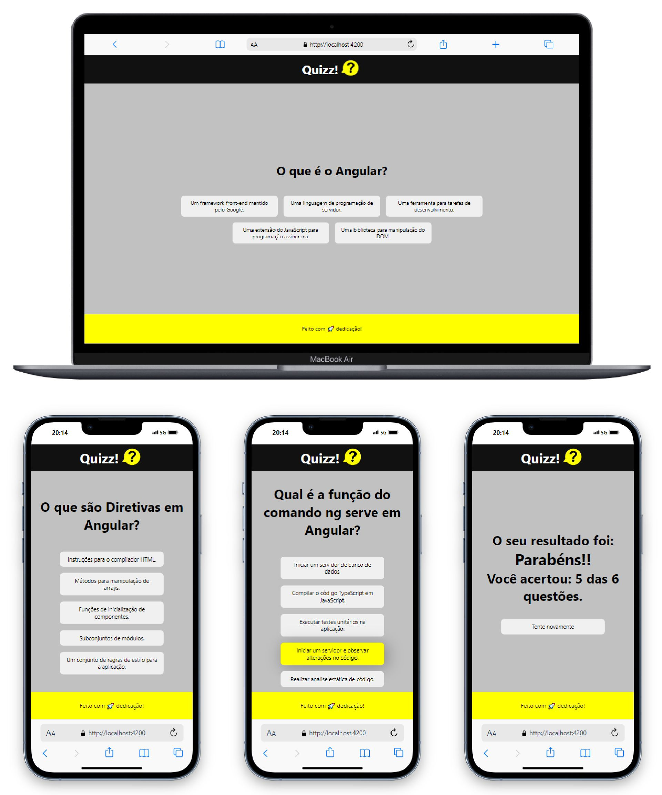

# ⚡ Projeto
## 🚀 Bem-vindo ao projeto Angular Quizz! 
### Este é um projeto de quizz desenvolvido em Angular. 
## Pré-requisitos

Antes de começar, certifique-se de ter o Node.js e o npm instalados em seu ambiente de desenvolvimento.

- Node.js: [Baixar Node.js](https://nodejs.org/)
- npm (gerenciador de pacotes do Node.js): Geralmente instalado junto com o Node.js

## Instalação

1. Baixe o projeto em arquivo zip para seu ambiente local e
navegue até a pasta do projeto:

   ```bash
   cd angular-quizz
      
2. Instale as dependências necessárias do projeto utilizando npm:

   ```bash
   npm install
      
3. Para iniciar o servidor de desenvolvimento do Angular e visualizar o projeto:

   ```bash
   ng serve


